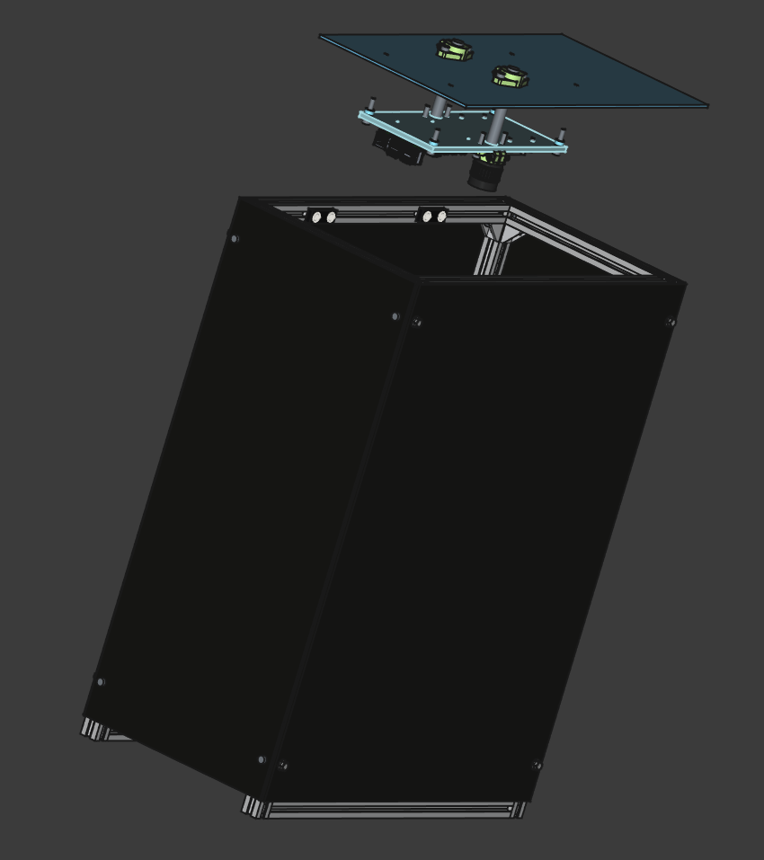

# slat-sort-cam-dark-box

Box used to hold a camera system, providing an initially dark environment and an adjustable lighting system.

## Project Overview

This project is developed in **FreeCAD 1.0.0**.

- **Main File**: The primary design file is `dbox_asm.FCStd`, located in the `assembly` folder.
- **Documentation**: Parts and material ordering documentation can be found in the `docs` folder.

## Features

- **Dark Environment**: Ensures initial dark conditions for precise image capture or experimentation.
- **Adjustable Lighting**: Includes a lighting system with customizable settings for controlled illumination.
- **Compact Design**: Optimized for portability and minimal footprint.
- **Light Isolation**: Prevents external light interference for consistent imaging.

## Applications

- Precision imaging for machine vision systems.
- Testing and calibrating camera sensors in controlled environments.
- Scientific experiments requiring adjustable lighting.

## Getting Started

### Prerequisites

- Install **FreeCAD 1.0.0** or a compatible version.
- Ensure all required materials and tools for assembly are available.

### Assembly Instructions

1. Open the `dbox_asm.FCStd` file in FreeCAD.
2. Follow the assembly instructions included in the `docs` folder.
3. Install the camera and lighting system inside the box.

## Usage

- Place the camera in the designated area within the box  - see `cam_holder_plate.FCStd`and `cam_holder_mount.FCStd`.
- Adjust the lighting system using the provided controls to meet your requirements.

## Documentation

- **Parts List and Material Ordering**: Detailed documentation is located in the `docs` folder.
  - Includes specifications for parts and ordering information.
  - Refer to the included files for a complete overview.

## License

This project is licensed under the **GNU General Public License (GPL)**. 

You are free to use, modify, and distribute the project under the terms of the GPL license. However, any derivative work must also be released under the same license. For more details, see the [GPL License](https://www.gnu.org/licenses/gpl-3.0.html).
